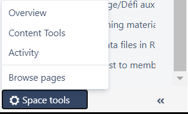
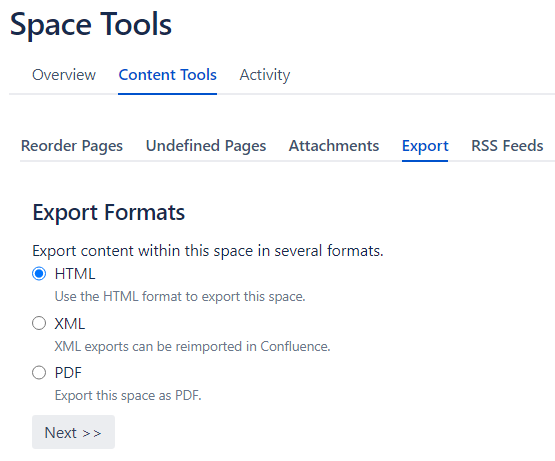
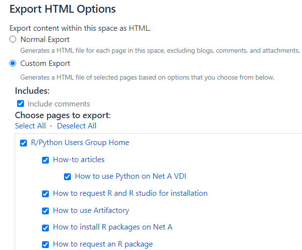
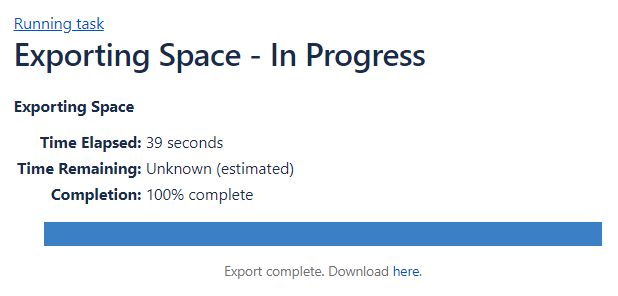

[(Français)](#le-nom-du-projet)

## Confluence to MD

Convert Confluence Spaces saved as HTML files to Markdown files  

# Steps to Converting a Confluence Space to Markdown

## Exporting Confluence Space as HTML
1. Visit the Confluence space of your choosing (I.e. R/Python Users Group (insert confluence link here))
2. Click on the bottom left corner `Space Tools`, then click on `Content Tools`  

3. Click on the `Export tab`, tick `HTML`, then click on `Next >>`  

4. You can now choose to export everything (`Normal Export`), or select which pages to export and if comments should be exported (`Custom Export`). Then, click on the `Export` button  

5. It will take some time to export your space into html (from experience, spaces have taken less than 1 minute to download). Once completed, click on `Download here`  


The space will be in your `Downloads` folder as a zip folder. Extract the contents, and move the unzipped folder to a folder of your choice.

## Using Pandoc in RStudio
There are only 2 packages you need to convert the HTML files to markdown:
- rmarkdown: For pandoc_convert function
- stringr: For string manipulation

In the same folder where the unzipped Confluence Space is, create an R script and copy and paste the following code into it:  
```r
library(rmarkdown) # For pandoc_convert
library(stringr) # For string manipulation

# Get all html files in RUG directory
files <- list.files(path = "./RUG", pattern = "\\.html$")

# Convert an entire confluence space into GitHub Flavoured Markdown
for (i in 1:length(files)){
  
  # Get the file path
  # For some reason, `.` in file path does not work. It needs the full filepath.
  fp <- paste0(getwd(), "/RUG/", files[i])
  
  # Convert to Markdown
  pandoc_convert(fp, to = "gfm", options = "--atx-headers", 
                 output = paste0(getwd(), "/", str_sub(files[i], 1, -5), "md"))
}
```
**Note**: Replace the RUG folder with the extracted Confluence Space's folder name.

This will convert all the HTML files into GitHub Flavoured Markdown in the current working directory. You can change the output path.

## Fixing File Paths

The file paths for the markdown outputs will be wrong, unless they are in the same folder as their original html files.

There are two solutions.
1. Move the attachments and images folders into the directory where the markdown files are; OR
2. Run the following script that replaces all instances of attachments and images to working/directory/attachments and working/directory/images:  
```r
# Get all md files in RUG Markdown Outputs directory
files <- list.files(path = "./RUG Markdown Outputs", pattern = "\\.md$")

# For each files
#for (i in 1:length(files)){
for (i in 1:1){

  # Get the file path
  # For some reason, `.` in file path does not work. It needs the full filepath.
  fp <- paste0(getwd(), "/RUG Markdown Outputs/", files[i])
  
  # Read the file
  md <- readLines(fp)
  
  # Replace all attachments with the directory that attachments is in
  str_replace_all(md, "(attachments", "(RUG/attachments")
  
  # Replace all imagess with the directory that images is in
  str_replace_all(md, "(images", "(RUG/images")
}
```

Congratulations! You have successfully converted your Confluence Space into Github Flavoured Markdown that can be rendered in GitLab!

### How to Contribute

See [CONTRIBUTING.md](CONTRIBUTING.md)

### License

Unless otherwise noted, the source code of this project is covered under Crown Copyright, Government of Canada, and is distributed under the [MIT License](LICENSE).

The Canada wordmark and related graphics associated with this distribution are protected under trademark law and copyright law. No permission is granted to use them outside the parameters of the Government of Canada's corporate identity program. For more information, see [Federal identity requirements](https://www.canada.ca/en/treasury-board-secretariat/topics/government-communications/federal-identity-requirements.html).

______________________

## Le nom du projet

- Quel est ce projet?
- Comment ça marche?
- Qui utilisera ce projet?
- Quel est le but de ce projet?

### Comment contribuer

Voir [CONTRIBUTING.md](CONTRIBUTING.md)

### Licence

Sauf indication contraire, le code source de ce projet est protégé par le droit d'auteur de la Couronne du gouvernement du Canada et distribué sous la [licence MIT](LICENSE).

Le mot-symbole « Canada » et les éléments graphiques connexes liés à cette distribution sont protégés en vertu des lois portant sur les marques de commerce et le droit d'auteur. Aucune autorisation n'est accordée pour leur utilisation à l'extérieur des paramètres du programme de coordination de l'image de marque du gouvernement du Canada. Pour obtenir davantage de renseignements à ce sujet, veuillez consulter les [Exigences pour l'image de marque](https://www.canada.ca/fr/secretariat-conseil-tresor/sujets/communications-gouvernementales/exigences-image-marque.html).
